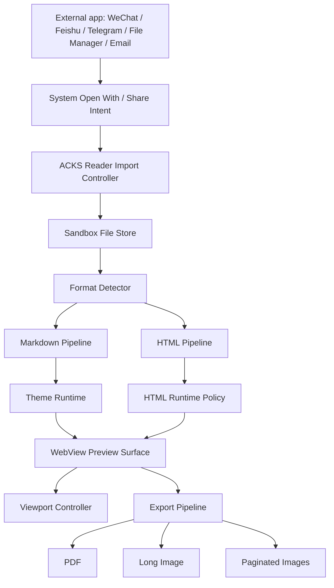

# ACKS Reader Development Specification

> **For AI agents:** This document is both a product development specification and an execution prompt. When implementing ACKS Reader, treat every requirement, screen, module, and acceptance criterion below as authoritative unless a newer product decision overrides it. Preserve the product positioning: ACKS Reader is a mobile-first universal Markdown/HTML reader, previewer, and export tool invoked from other apps through the system "Open with" flow.

**Product name:** ACKS Reader  
**Document version:** 0.1  
**Date:** 2026-05-31  
**Primary platforms:** Android first, iOS second  
**Recommended architecture:** Native mobile shell + system WebView rendering engine + Markdown-to-HTML pipeline + theme runtime + export pipeline  
**Primary goal:** Let users open Markdown and HTML files received from WeChat, Feishu, Telegram, file managers, email, cloud drives, and other apps, preview them beautifully and accurately, then export the rendered result as PDF or images.

---

## 1. Product Summary

ACKS Reader solves a common mobile document problem: Markdown and local HTML files are often inconvenient to open inside social, messaging, and productivity apps. WeChat, Feishu, Telegram, file managers, and many cloud-drive apps may download these files but cannot reliably render them as polished documents. Users are forced to install generic Markdown editors, use a browser, or copy content elsewhere. The result is fragmented, inconsistent, and often visually poor.

ACKS Reader should become the preferred mobile "Open with" destination for `.md`, `.markdown`, `.html`, `.htm`, and optionally `.zip` HTML bundles. It should not behave like a full file manager or a generic browser. Its job is to receive a document from another app, render it quickly and beautifully, allow style/viewport adjustments, and export the visible result.

The key product bet is that high-quality preview is itself valuable. Markdown rendering should not be a plain HTML conversion. It should provide multiple carefully designed themes with distinct typography, heading systems, table styles, code blocks, callouts, backgrounds, and export behavior. HTML rendering should support modern AI-generated pages, including responsive layouts, animation, JavaScript, Canvas, SVG, and high-interaction demos, while still offering a safer restricted mode for unknown files.

---

## 2. Target Users

### 2.1 Primary Users

1. **AI-heavy knowledge workers**
   - Receive or generate Markdown/HTML reports, notes, prototypes, or analysis files.
   - Need to preview files on mobile without opening a desktop computer.
   - Care about exporting polished PDF or long images for sharing.

2. **Developers and technical creators**
   - Receive README files, technical notes, API docs, changelogs, code snippets, or generated HTML demos.
   - Need code highlighting, tables, Mermaid diagrams, math, and local asset support.

3. **Product, operations, and business users**
   - Receive Markdown reports from AI tools, automation workflows, or coworkers.
   - Need attractive themes for business reports, summaries, weekly updates, and customer-facing documents.

4. **Students, researchers, and writers**
   - Read Markdown notes, study materials, paper outlines, and HTML visualizations.
   - Need good reading typography, dark mode, PDF export, and image export.

### 2.2 Non-Target Users

ACKS Reader is not initially designed to be:

- A full Markdown editor.
- A complete code editor.
- A general web browser.
- A cloud document collaboration platform.
- A file-sync product.

Editing, cloud sync, collaboration, and browser-like tabs can be considered later, but they must not distort the first version.

---

## 3. Product Positioning

### 3.1 One-Sentence Positioning

ACKS Reader is a mobile universal Markdown/HTML preview and export app that opens files from WeChat, Feishu, Telegram, file managers, and other apps, renders them beautifully, and exports them as PDF or images.

### 3.2 User Promise

When a user receives a Markdown or HTML file on their phone, they should be able to tap "Open with ACKS Reader" and get a fast, polished, reliable preview without installing a separate note app, copying text, or depending on a browser.

### 3.3 Differentiation

ACKS Reader should differ from normal Markdown readers in four ways:

1. **Universal app entry**
   - Works from messaging apps, productivity apps, file managers, download folders, email, and cloud drives.

2. **Design-grade Markdown preview**
   - Includes multiple professional rendering themes, not just basic Markdown-to-HTML output.

3. **Modern HTML runtime**
   - Supports AI-generated interactive HTML with JavaScript, animation, Canvas, SVG, and responsive viewport modes.

4. **WYSIWYG export**
   - Exports the exact preview style to PDF, long image, or paginated images.

---

## 4. Core Use Cases

### 4.1 Open Markdown From Another App

**Scenario:** A user receives `report.md` in WeChat, Feishu, Telegram, email, or a file manager.

**Flow:**

1. User downloads the file.
2. User taps "Open with" or "Share/Open in another app".
3. User selects ACKS Reader.
4. ACKS Reader imports the file into app sandbox.
5. ACKS Reader detects Markdown format and renders it with the default theme.
6. User switches themes, adjusts viewport, or exports.

**Success criteria:**

- ACKS Reader appears as a valid target for `.md` and `.markdown`.
- First preview appears quickly for ordinary documents.
- File title, source format, current theme, and export entry are visible.
- Markdown tables, code blocks, images, headings, task lists, links, and blockquotes render correctly.

### 4.2 Open Interactive HTML From Another App

**Scenario:** A user receives an AI-generated `index.html` containing CSS, JavaScript, animation, SVG, Canvas, or interactive controls.

**Flow:**

1. User opens the file with ACKS Reader.
2. ACKS Reader imports the file into sandbox.
3. ACKS Reader detects HTML format.
4. ACKS Reader opens it in Safe Preview Mode by default if the file is unknown.
5. User can switch to Full Interactive Mode.
6. User can toggle mobile, desktop, A4, or custom viewport widths.
7. User exports the rendered page to PDF or image.

**Success criteria:**

- HTML renders using the platform WebView engine.
- Inline CSS, inline JS, SVG, Canvas, and CSS animation work in Full Interactive Mode.
- Local relative assets are resolved when available.
- Safe Preview Mode limits risky behavior.
- User understands when a file is running scripts.

### 4.3 Choose a Markdown Theme

**Scenario:** A user wants the same Markdown document to look like a business report, technical article, academic note, social share card, or dark reading page.

**Flow:**

1. User opens the Theme panel.
2. User sees theme thumbnails or live preview cards.
3. User taps a theme.
4. Preview updates immediately.
5. User exports with selected theme.

**Success criteria:**

- At least 10 built-in themes exist in the full product; MVP can ship with 5.
- Theme switching does not re-import the document.
- Themes are visually distinct in typography, spacing, table design, code block style, and heading hierarchy.
- Themes work in light/dark system modes where applicable.

### 4.4 Export Rendered Result

**Scenario:** A user previews a document and wants to share it as PDF or image.

**Flow:**

1. User taps Export.
2. User selects PDF, long image, or paginated images.
3. User selects viewport/export preset: phone width, desktop width, A4, social long image, or custom width.
4. ACKS Reader renders the document at the chosen dimensions.
5. User previews export result.
6. User saves or shares the file.

**Success criteria:**

- Export result matches preview style.
- PDF pagination is stable and readable.
- Long image export handles long documents without text overlap or truncation.
- Export failure gives a clear retry path.

---

## 5. Platform Strategy

### 5.1 Recommended Launch Order

1. **Android first**
   - Stronger control over intent filters and file-opening flows.
   - More flexible file access and sharing behavior.
   - Easier to validate WeChat/Feishu/Telegram/file-manager entry flows.

2. **iOS second**
   - Use document types, share extensions, and `WKWebView`.
   - More restrictive file/import behavior, but still viable.

### 5.2 Recommended Native Technology Stack

#### Android

- Language: Kotlin
- UI: Jetpack Compose
- Rendering: Android System WebView
- File entry: Intent filters for MIME types and extensions
- Storage: App-specific sandbox storage plus optional user-selected export directory
- Background tasks: Kotlin coroutines
- PDF export: WebView print/PDF flow or platform print adapter
- Image export: WebView capture, tiled capture, or print-rendered bitmap pipeline

#### iOS

- Language: Swift
- UI: SwiftUI
- Rendering: WKWebView
- File entry: Document Types, UTType declarations, Share/Open In flow
- Storage: App sandbox with security-scoped resource handling where required
- PDF export: WKWebView PDF generation / print renderer
- Image export: WKWebView snapshot or paginated render pipeline

#### Shared Optional Layer

Use shared code only where it does not make the app heavier or slower:

- Markdown parsing and AST normalization
- Theme manifest validation
- Export preset definitions
- File format detection
- HTML sanitization helpers

Possible shared technologies:

- Kotlin Multiplatform for Android-first teams.
- Rust core for performance-sensitive parsing, sanitization, and deterministic tests.

Avoid forcing cross-platform frameworks for the first version unless the team has strong existing expertise. The rendering core is platform WebView anyway, so native shell code gives better file integration, smaller package size, and more predictable performance.

### 5.3 Technology Choices to Avoid Initially

- Do not embed a full Chromium runtime.
- Do not build a custom HTML renderer.
- Do not make Flutter or React Native the default choice unless team capability clearly favors it.
- Do not build cloud sync, account login, or collaboration before the local open-preview-export loop is excellent.

---

## 6. System Architecture

### 6.1 High-Level Architecture



### 6.2 Module Responsibilities

#### 6.2.1 File Entry Module

Responsibilities:

- Register the app as an opener for supported file types.
- Receive files from external apps.
- Resolve content URIs and temporary file handles.
- Copy imported files into ACKS Reader sandbox.
- Preserve original file name, size, extension, source URI when available, import time, and checksum.

Supported inputs:

- `.md`
- `.markdown`
- `.html`
- `.htm`
- `.txt` as optional Markdown-compatible fallback
- `.zip` as optional HTML bundle input

Acceptance criteria:

- Opening the same file from WeChat, Feishu, Telegram, Android file manager, and email should enter the same preview flow.
- If the external URI expires after import, ACKS Reader should still open the sandbox copy.
- File import errors should show a useful message.

#### 6.2.2 Format Detection Module

Responsibilities:

- Determine whether the input is Markdown, HTML, plain text, or unsupported.
- Use extension, MIME type, and content sniffing.
- Detect encoding and normalize to UTF-8 where possible.
- Identify HTML bundles in ZIP files.

Detection rules:

- `.md` and `.markdown` default to Markdown.
- `.html` and `.htm` default to HTML.
- `.txt` may be opened as Markdown if user chooses.
- ZIP bundle is valid if it contains `index.html` or exactly one root HTML file.

Acceptance criteria:

- Incorrect MIME types from external apps should not break obvious extension-based files.
- Unknown file types should show an unsupported-file screen with clear supported formats.

#### 6.2.3 Markdown Pipeline

Responsibilities:

- Parse Markdown into an AST or structured intermediate representation.
- Support CommonMark and GitHub-Flavored Markdown features.
- Convert parsed content to semantic HTML with stable class names.
- Support optional extensions:
  - Tables
  - Task lists
  - Strikethrough
  - Footnotes
  - Table of contents
  - Code fences
  - Mermaid diagrams
  - Math via KaTeX or MathJax
  - Front matter metadata
  - Image sizing hints where practical

Recommended output approach:

- Render Markdown into a controlled HTML document.
- Inject theme CSS, code highlighting CSS, extension scripts, and viewport metadata.
- Avoid rendering Markdown directly with native UI components in the first version.

Acceptance criteria:

- Markdown output uses predictable tags and classes.
- Theme CSS can style headings, paragraphs, lists, tables, code, blockquotes, callouts, footnotes, and images.
- Common AI-generated Markdown files render without malformed layout.

#### 6.2.4 Markdown Theme Runtime

Responsibilities:

- Provide built-in themes.
- Apply a selected theme without reparsing source content.
- Manage CSS variables, fonts, background, spacing, and export behavior.
- Allow future custom themes without rewriting renderer logic.

Theme structure:

```json
{
  "id": "business-report",
  "name": "Business Report",
  "description": "Dense, polished report layout for business documents.",
  "supportedModes": ["light", "dark"],
  "defaultMode": "light",
  "cssFile": "themes/business-report.css",
  "previewThumbnail": "themes/business-report.png",
  "fontPolicy": {
    "preferredSerif": "system",
    "preferredSans": "system",
    "preferredMono": "system"
  },
  "export": {
    "preferredPdfPreset": "a4",
    "preferredImagePreset": "phone-long"
  }
}
```

Minimum built-in theme set:

1. Clean Reading
2. Business Report
3. Technical Docs
4. Academic Paper
5. WeChat Article
6. Social Long Image
7. Dark Code
8. Minimal Note
9. Magazine Essay
10. AI Report

MVP theme set:

1. Clean Reading
2. Business Report
3. Technical Docs
4. Dark Code
5. Social Long Image

Theme design rules:

- Themes must be visually distinct, not just color variants.
- Tables must be readable on mobile.
- Code blocks must allow horizontal scroll when needed.
- Headings must create obvious hierarchy.
- Blockquotes and callouts must be styled intentionally.
- Theme CSS must be responsive across phone, tablet, desktop, and A4 widths.
- Export styles must use print-aware CSS where relevant.

#### 6.2.5 HTML Pipeline

Responsibilities:

- Load local HTML into WebView/WKWebView with correct base URL.
- Resolve relative CSS, JS, image, font, and media paths when files are available.
- Support single-file HTML and HTML bundles.
- Provide Safe Preview Mode and Full Interactive Mode.

Safe Preview Mode:

- Default for unknown HTML.
- May disable or restrict JavaScript.
- Blocks risky local file access.
- Blocks or prompts for external network requests.
- Shows a visible trust/control indicator.

Full Interactive Mode:

- Allows JavaScript and animation.
- Supports Canvas, SVG, WebGL where platform WebView supports it.
- Allows local relative assets inside the imported bundle.
- Does not grant arbitrary user file-system access.

Acceptance criteria:

- A self-contained AI-generated HTML file with CSS/JS renders correctly.
- A bundled HTML file with `assets/` renders correctly after ZIP import.
- Switching viewport size reloads or resizes without corrupting state unexpectedly.

#### 6.2.6 Preview Surface

Responsibilities:

- Host the WebView/WKWebView.
- Provide a native top bar and bottom action area.
- Support zoom, scroll, theme switch, viewport switch, and export.
- Show loading, error, unsupported, and permission states.

Required preview modes:

- Phone width
- Desktop width
- A4 width
- Social long-image width
- Custom width

Optional later modes:

- Tablet width
- Split compare mode
- Source/preview split
- Print preview

Acceptance criteria:

- Preview should feel like opening a document, not navigating a browser.
- The WebView should fill available space.
- Native controls should not overlap document content.
- Orientation changes should preserve document and user-selected settings.

#### 6.2.7 Export Pipeline

Responsibilities:

- Export the rendered document exactly as configured.
- Support PDF, long image, and paginated images.
- Support export presets.
- Offer save and share actions.

Export presets:

1. Phone Reading: 390 px logical width
2. Desktop Preview: 1024 or 1280 px logical width
3. A4 PDF: print-friendly width
4. WeChat Long Image: mobile width with long-scroll capture
5. Custom: user-selected width and scale

PDF export:

- Use platform WebView print/PDF capabilities where possible.
- Respect print CSS.
- Provide preview when feasible.

Image export:

- Use tiled capture for long documents to avoid memory failures.
- Stitch tiles carefully with stable scale.
- Provide paginated fallback for very long pages.

Acceptance criteria:

- Exported PDF and images match selected theme and viewport.
- Large documents do not crash the app.
- Long image export warns or paginates when image dimensions exceed platform limits.

#### 6.2.8 Security and Privacy Module

Responsibilities:

- Keep imported files inside app sandbox.
- Never allow HTML to read arbitrary user files.
- Control script execution.
- Control network access where possible.
- Avoid sending content to servers by default.

Security principles:

- Local-first by default.
- No account required for MVP.
- No telemetry containing document contents.
- User must explicitly enable Full Interactive Mode for untrusted HTML if Safe Preview blocks scripts.
- External links should open through a confirmation or system browser.

Acceptance criteria:

- Unknown HTML cannot access unrelated local files.
- HTML cannot silently export or upload user content through privileged native APIs.
- App permissions are minimal.

---

## 7. UI/UX Specification

### 7.1 Design Principles

ACKS Reader should feel fast, precise, and document-focused. It should not feel like a marketing app, a heavy note-taking workspace, or a generic browser. The interface should stay quiet while the document carries the visual richness.

Principles:

- Start in preview, not a dashboard.
- Keep controls close to the document task: theme, viewport, export, safety.
- Avoid decorative UI that competes with rendered themes.
- Use compact panels and bottom sheets for mobile ergonomics.
- Make import/open errors understandable.
- Make dangerous HTML capabilities explicit but not frightening.

### 7.2 Information Architecture

Primary surfaces:

1. **Open Preview Screen**
2. **Theme Picker**
3. **Viewport Picker**
4. **Export Sheet**
5. **Document Info Sheet**
6. **Settings**
7. **Recent Files** as a secondary entry, not the first-run focus

### 7.3 Open Preview Screen

Purpose:

- Display the rendered document immediately after import.
- Provide essential actions without clutter.

Layout:

- Top app bar:
  - Back
  - File title
  - Format badge: MD / HTML / Bundle
  - Safety status for HTML
  - More menu
- Main area:
  - WebView preview surface
- Bottom toolbar:
  - Theme
  - Viewport
  - Export
  - Search or TOC
  - More

States:

- Loading import
- Loading render
- Rendered
- Unsupported file
- Broken file
- HTML safety warning
- Export in progress

Acceptance criteria:

- User can open a file and understand what format is being previewed.
- User can switch theme or viewport in one or two taps.
- Export is always discoverable.

### 7.4 Theme Picker

Purpose:

- Let users choose a professional Markdown rendering style.

Behavior:

- For Markdown files, show theme grid/list.
- For HTML files, hide Markdown theme picker or replace it with viewport/style controls.
- Theme selection updates preview immediately.
- Recent themes or favorites can be added later.

Theme card content:

- Theme name
- Small live or generated preview thumbnail
- Best-use label: Reading, Business, Technical, Social, Dark
- Light/dark support indicator

Acceptance criteria:

- Themes are visually distinguishable from thumbnails.
- User can compare theme effect without leaving preview.

### 7.5 Viewport Picker

Purpose:

- Let the user preview the same content as phone, desktop, A4, social image, or custom width.

Controls:

- Segmented options:
  - Phone
  - Desktop
  - A4
  - Social
  - Custom
- Custom width input or slider.
- Optional orientation switch for desktop/tablet.

Acceptance criteria:

- Changing viewport produces a visibly different layout when content is responsive.
- Current viewport is clearly shown.
- Export uses the selected viewport unless user overrides it.

### 7.6 Export Sheet

Purpose:

- Convert current preview into shareable output.

Export options:

- PDF
- Long image
- Paginated images

Controls:

- Output type
- Export preset
- Page size or width
- Background on/off where theme supports it
- Include file title/date option
- Save
- Share

States:

- Ready
- Rendering
- Preview generated
- Failed with retry
- File too large with suggested pagination

Acceptance criteria:

- Export options are understandable without technical jargon.
- Export result can be shared back into WeChat, Feishu, Telegram, or system share sheet.

### 7.7 HTML Safety UX

Purpose:

- Make script and network risk visible while preserving power-user capability.

Recommended UX:

- When opening HTML:
  - Show subtle status: "Safe Preview" or "Interactive".
  - If scripts are blocked, show a small inline prompt: "This HTML contains scripts. Enable interactive mode?"
  - Provide "Enable once" and "Always trust this file" only after import.

Acceptance criteria:

- User understands why an HTML file may not fully animate in Safe Preview.
- Full Interactive Mode is available but deliberate.

### 7.8 Recent Files

Purpose:

- Help users reopen imported files.

Rules:

- Recent files are secondary.
- First-run experience should explain how to use "Open with" from other apps.
- Users can delete recent entries and imported copies.

Acceptance criteria:

- Recent list does not become a confusing file manager.
- Deleting a recent file removes local sandbox copy unless user chooses otherwise.

---

## 8. Design System Guidance

### 8.1 Native App Visual Style

The app shell should be restrained:

- Neutral background.
- High legibility.
- Minimal chrome.
- Compact bottom sheets.
- Clear icon buttons with labels where needed.
- Avoid bright gradients and decorative effects.

The rendered document themes may be expressive; the app shell should not compete with them.

### 8.2 Suggested Tokens

Spacing:

- `space-1`: 4
- `space-2`: 8
- `space-3`: 12
- `space-4`: 16
- `space-5`: 20
- `space-6`: 24
- `space-8`: 32

Radius:

- `radius-sm`: 4
- `radius-md`: 8
- `radius-lg`: 12 for sheets/dialogs only

Typography:

- App UI should use system font.
- Document themes may use system serif/sans/mono combinations.
- Avoid bundling many large fonts in MVP.

Color:

- App shell:
  - Background: neutral light/dark
  - Surface: slightly elevated neutral
  - Text primary/secondary
  - Accent: one restrained brand color
- Document themes:
  - Each theme controls its own palette.

Accessibility:

- Dynamic font scaling for app UI.
- Keyboard/switch access where platform supports it.
- WCAG AA contrast for app chrome.
- Touch targets at least platform minimum size.

---

## 9. Built-In Markdown Theme Requirements

### 9.1 Clean Reading

Use case:

- Long-form reading, notes, essays, ordinary Markdown.

Style:

- Calm typography.
- Generous line height.
- Clear heading hierarchy.
- Simple tables.
- Soft blockquotes.

### 9.2 Business Report

Use case:

- Weekly reports, summaries, analysis documents, Feishu-like work docs.

Style:

- Dense but polished.
- Strong section dividers.
- Professional tables.
- Compact list spacing.
- Export-friendly A4 behavior.

### 9.3 Technical Docs

Use case:

- README, API docs, engineering notes, changelogs.

Style:

- Excellent code highlighting.
- Sticky or generated TOC later.
- Strong inline code style.
- Responsive tables.
- Clear warning/info callouts.

### 9.4 Dark Code

Use case:

- Code-heavy documents, night reading.

Style:

- Dark background.
- High contrast code blocks.
- Good syntax highlighting.
- Avoid low-contrast gray text.

### 9.5 Social Long Image

Use case:

- Exporting shareable images to WeChat, Telegram, or social feeds.

Style:

- Strong title treatment.
- Larger type.
- Controlled width.
- Attractive quote/callout blocks.
- Background suitable for long image export.

### 9.6 Future Themes

- Academic Paper
- WeChat Article
- Minimal Note
- Magazine Essay
- AI Report
- Product Spec
- Meeting Notes
- Research Brief
- Presentation Handout
- Elegant Serif

---

## 10. File and Data Model

### 10.1 Document Record

```json
{
  "id": "uuid",
  "title": "report.md",
  "originalFileName": "report.md",
  "format": "markdown",
  "sourceApp": "unknown",
  "sourceUri": "content://...",
  "sandboxPath": "documents/{id}/source.md",
  "importedAt": "2026-05-31T10:00:00Z",
  "sizeBytes": 123456,
  "checksum": "sha256...",
  "lastThemeId": "business-report",
  "lastViewportPreset": "phone",
  "trustedHtml": false
}
```

### 10.2 Render Settings

```json
{
  "documentId": "uuid",
  "themeId": "clean-reading",
  "colorMode": "system",
  "viewportPreset": "phone",
  "customWidth": null,
  "fontScale": 1.0,
  "htmlMode": "safe",
  "enableMermaid": true,
  "enableMath": true
}
```

### 10.3 Export Job

```json
{
  "id": "uuid",
  "documentId": "uuid",
  "type": "pdf",
  "preset": "a4",
  "width": null,
  "status": "pending",
  "outputPath": null,
  "createdAt": "2026-05-31T10:05:00Z",
  "error": null
}
```

---

## 11. Performance Requirements

### 11.1 Startup and Import

Targets:

- Cold app launch to first loading screen: under 1.5 seconds on mid-range devices where feasible.
- Ordinary Markdown preview under 2 seconds for files under 1 MB.
- Ordinary single-file HTML preview under 2 seconds after import.

Implementation notes:

- Copy file first, then parse/render asynchronously.
- Cache rendered Markdown HTML when source and theme-independent pipeline output have not changed.
- Avoid loading all themes or large libraries at startup.
- Load Mermaid/math libraries only when document needs them.

### 11.2 Package Size

Targets:

- Keep MVP Android APK/AAB as small as practical by relying on system WebView.
- Avoid bundling large font families.
- Avoid embedded Chromium.
- Avoid large unused JS libraries.

### 11.3 Large Documents

Rules:

- Detect large files and show progress.
- Avoid loading multiple full-size render copies into memory.
- Use tiled export for long images.
- Offer paginated image export if long-image dimensions exceed safe limits.

---

## 12. Security and Privacy Requirements

### 12.1 Local-First Policy

ACKS Reader must work offline for local Markdown and HTML files. The app must not upload document content by default.

### 12.2 HTML Security

Risks:

- Malicious JavaScript.
- External network requests.
- Local file access attempts.
- Phishing-like HTML pretending to be app UI.

Mitigations:

- Use sandboxed local import directory.
- Restrict local file access to imported bundle.
- Disable or restrict JavaScript in Safe Preview Mode.
- Use explicit user action for Full Interactive Mode.
- Do not expose privileged native bridges to arbitrary HTML.
- Open external links outside the WebView or after confirmation.

### 12.3 Permissions

MVP should request as few permissions as possible:

- No contacts.
- No location.
- No microphone.
- No camera.
- Storage access only through system file picker/share/export mechanisms where possible.

---

## 13. Error Handling

### 13.1 Import Errors

Examples:

- File no longer available.
- Permission denied.
- Unsupported file type.
- File too large.
- Encoding unreadable.

UX:

- Show short message.
- Show supported formats.
- Offer retry or choose another app/file.

### 13.2 Render Errors

Examples:

- Markdown parse failure.
- HTML missing assets.
- JavaScript error.
- WebView crash or blank page.

UX:

- Show fallback source preview when possible.
- For HTML missing assets, show missing path count if detectable.
- For scripts blocked by safe mode, offer interactive mode.

### 13.3 Export Errors

Examples:

- Out of memory during long image export.
- PDF generation failed.
- No write permission.
- Output file too large.

UX:

- Offer smaller width, paginated images, or PDF fallback.
- Keep user settings after failure.

---

## 14. MVP Scope

### 14.1 Must Have

- Android app.
- Register as opener for `.md`, `.markdown`, `.html`, `.htm`.
- Import file into sandbox.
- Markdown rendering with GFM tables, task lists, code fences, links, images.
- HTML rendering with WebView.
- Safe and Interactive HTML modes.
- At least 5 Markdown themes.
- Viewport presets: Phone, Desktop, A4, Social.
- Export to PDF.
- Export to long image or paginated image.
- Share exported file.
- Recent files list.
- Basic settings.

### 14.2 Should Have

- Mermaid support.
- Math support.
- ZIP HTML bundle support.
- Search within document.
- Table of contents.
- Theme thumbnails.
- Export preview.
- Dark mode for app shell.

### 14.3 Could Have Later

- Custom themes.
- Cloud sync.
- Built-in editor.
- OCR import.
- Web clipping.
- Browser extension or desktop companion.
- Template marketplace.
- AI-assisted document polishing.

### 14.4 Explicitly Out of Scope for MVP

- Account system.
- Real-time collaboration.
- Full browser tabs and address bar.
- Markdown editing.
- Cloud storage integration.
- Public hosting service.

---

## 15. Implementation Plan

> **For AI implementation:** Implement in small vertical slices. Do not start by building all screens. First make the external-file-to-preview path work, then add themes, then export, then polish.

### Phase 1: Android Import and Basic Preview

Goal:

- Open Markdown/HTML from external apps and render inside ACKS Reader.

Tasks:

1. Create Android Kotlin project with Jetpack Compose.
2. Add intent filters for Markdown and HTML extensions/MIME types.
3. Implement file import controller for content URIs.
4. Copy source file into app sandbox.
5. Implement format detection.
6. Build preview screen with WebView.
7. Render raw HTML in WebView.
8. Render Markdown through a basic Markdown-to-HTML pipeline.
9. Add loading and error states.
10. Test with files opened from file manager, WeChat, Feishu, Telegram, and email where available.

Acceptance:

- User can open `.md` and `.html` from external apps.
- Preview appears inside ACKS Reader.
- App survives process restart after import.

### Phase 2: Markdown Theme Runtime

Goal:

- Make Markdown preview visually differentiated and export-ready.

Tasks:

1. Define semantic Markdown HTML structure and CSS class naming.
2. Implement theme manifest model.
3. Add theme asset loader.
4. Build Theme Picker UI.
5. Implement 5 MVP themes.
6. Add syntax highlighting.
7. Add responsive table handling.
8. Add theme persistence per document.
9. Test themes across short, long, table-heavy, and code-heavy Markdown.

Acceptance:

- User can switch themes without reimporting file.
- Themes are visually distinct.
- Markdown output remains stable across viewport modes.

### Phase 3: Viewport and HTML Runtime Modes

Goal:

- Support mobile/desktop/A4/social preview and safe/interactive HTML.

Tasks:

1. Define viewport preset model.
2. Add Viewport Picker UI.
3. Resize WebView content container or inject viewport behavior.
4. Add Safe Preview Mode for HTML.
5. Add Full Interactive Mode toggle.
6. Add local asset handling for imported HTML directory where possible.
7. Add ZIP bundle import if included in MVP.
8. Test AI-generated HTML examples with animation, Canvas, SVG, and JS.

Acceptance:

- User can switch viewport presets.
- Interactive HTML can run when enabled.
- Unknown HTML defaults to safer behavior.

### Phase 4: Export

Goal:

- Export rendered preview to PDF and images.

Tasks:

1. Define export job model.
2. Build Export Sheet UI.
3. Implement PDF export using platform WebView print/PDF capability.
4. Implement long image capture with tiled fallback.
5. Implement paginated image export.
6. Add export progress and error handling.
7. Add system share sheet integration.
8. Test large documents and long pages.

Acceptance:

- Exported PDF/image matches selected theme and viewport.
- Exported file can be shared to WeChat, Feishu, Telegram, and file manager.
- Long documents do not crash the app.

### Phase 5: Polish, Testing, and Release Readiness

Goal:

- Make the product stable enough for beta users.

Tasks:

1. Add recent files.
2. Add document info sheet.
3. Add settings.
4. Add empty first-run guidance.
5. Add accessibility pass.
6. Add performance profiling.
7. Add crash/error logging without document content.
8. Add sample document test suite.
9. Prepare beta release checklist.

Acceptance:

- App has a coherent first-run and repeat-use experience.
- Common failure cases are handled.
- Package size, startup, and export performance are acceptable.

---

## 16. Testing Strategy

### 16.1 Test Document Set

Create a local fixture set:

- Simple Markdown note.
- Long Markdown report.
- Table-heavy Markdown.
- Code-heavy Markdown.
- Markdown with images.
- Markdown with Mermaid.
- Markdown with math.
- Self-contained interactive HTML.
- HTML with external assets.
- HTML bundle ZIP.
- Malformed HTML.
- Very long HTML page.

### 16.2 Automated Tests

Recommended tests:

- Format detection unit tests.
- Markdown conversion snapshot tests.
- Theme manifest validation tests.
- Import controller tests with mocked URI/file sources.
- Export preset calculation tests.
- Security policy tests for HTML modes.

### 16.3 Manual QA Matrix

Apps to test opening from:

- WeChat
- Feishu
- Telegram
- Android file manager
- Email app
- Browser downloads
- Cloud drive apps if available

Devices:

- Small Android phone.
- Large Android phone.
- Tablet if possible.
- Low-memory device/emulator.

Scenarios:

- Open file first time.
- Reopen recent file.
- Rotate device.
- Switch theme.
- Switch viewport.
- Export PDF.
- Export long image.
- Share exported file.
- Open untrusted HTML.

---

## 17. Acceptance Criteria for Version 1.0

ACKS Reader 1.0 is acceptable when:

1. It appears as an opener for supported files in major Android apps.
2. It opens Markdown and HTML reliably from external app file flows.
3. It renders Markdown with at least 5 polished, distinct themes.
4. It renders modern single-file HTML with WebView.
5. It supports safe and interactive HTML modes.
6. It supports phone, desktop, A4, and social image viewport presets.
7. It exports PDF and image output that match preview.
8. It handles large documents without common crashes.
9. It does not upload document contents by default.
10. It has clear loading, error, unsupported, and export states.

---

## 18. Architecture Decisions

### ADR-001: Use Native Mobile Shells Instead of Cross-Platform UI First

**Decision:** Build Android first with Kotlin and Jetpack Compose, then iOS with Swift/SwiftUI.

**Reasoning:** ACKS Reader depends heavily on OS-level file opening, app sandbox behavior, WebView integration, export APIs, and share sheets. Native development provides better control, smaller package size, faster startup, and fewer abstraction leaks.

**Trade-off:** More platform-specific code. This is acceptable because rendering is handled by platform WebViews and the core product is OS integration heavy.

### ADR-002: Use System WebView/WKWebView for Rendering

**Decision:** Use Android System WebView and iOS WKWebView for HTML and Markdown preview output.

**Reasoning:** Modern HTML, CSS, JavaScript, animation, Canvas, SVG, and responsive layout require a real browser engine. System WebViews avoid bundling Chromium and keep the app smaller.

**Trade-off:** Behavior may differ slightly by platform and OS version. Use fixture testing to manage compatibility.

### ADR-003: Render Markdown to Semantic HTML, Then Theme With CSS

**Decision:** Markdown is parsed to semantic HTML and displayed in WebView with theme CSS.

**Reasoning:** This provides high-quality typography, print/export consistency, extensible themes, and reuse of WebView export paths.

**Trade-off:** Native text selection and accessibility may be less direct than fully native rendering. WebView accessibility should be tested carefully.

### ADR-004: Local-First and Sandbox-First

**Decision:** Imported files are copied into app sandbox and processed locally.

**Reasoning:** Users trust a document reader with private files. Local-first behavior also improves speed and offline reliability.

**Trade-off:** Recent files consume local storage. Provide cleanup controls.

---

## 19. AI Development Prompt

Use the following prompt to hand this product to an AI coding agent:

```text
You are implementing ACKS Reader, a mobile-first universal Markdown/HTML reader, previewer, and export tool.

Core positioning:
- ACKS Reader is not a generic browser, not a full Markdown editor, and not a file manager.
- It is an "Open with" target for Markdown and HTML files received from WeChat, Feishu, Telegram, file managers, email, cloud drives, and other apps.
- It imports files into app sandbox, detects format, renders Markdown/HTML, lets users switch themes and viewport presets, then exports the rendered result as PDF or images.

Architecture:
- Android first: Kotlin + Jetpack Compose + Android System WebView.
- iOS later: Swift + SwiftUI + WKWebView.
- Markdown is parsed to semantic HTML, then styled with CSS themes.
- HTML is rendered in WebView with Safe Preview Mode and Full Interactive Mode.
- Export must be WYSIWYG relative to selected theme and viewport.

Do not:
- Embed Chromium.
- Build a custom HTML renderer.
- Add accounts, cloud sync, collaboration, or editing in MVP.
- Upload document content by default.
- Expose privileged native bridges to arbitrary HTML.

Build in this order:
1. Android import from external apps for .md, .markdown, .html, .htm.
2. Sandbox copy and format detection.
3. Basic WebView preview.
4. Markdown-to-HTML pipeline.
5. Theme runtime with 5 themes.
6. Viewport presets.
7. Safe/interactive HTML mode.
8. PDF and image export.
9. Recent files, settings, polish, and QA.

Use the acceptance criteria in this document as the implementation checklist.
```

---

## 20. Open Questions

1. Should MVP include iOS, or should Android beta validate demand first?
2. Should ZIP HTML bundle support be MVP or version 1.1?
3. Should Mermaid/math support be bundled locally or loaded only when needed?
4. Should custom user themes be supported in version 1.0 or later?
5. Should ACKS Reader provide a lightweight edit/source view, or remain preview-only at launch?
6. What is the intended monetization model: free, paid app, pro export features, or theme packs?

---

## 21. Recommended Next Step

The next useful artifact is a UI design brief with screen-by-screen wireframes:

1. First-run empty state.
2. Open Preview Screen.
3. Theme Picker.
4. Viewport Picker.
5. Export Sheet.
6. HTML Safety Prompt.
7. Recent Files.
8. Settings.

After that, create a separate engineering implementation plan with exact Android package structure, Compose screens, data classes, WebView wrapper, Markdown pipeline, theme asset structure, and test fixtures.
